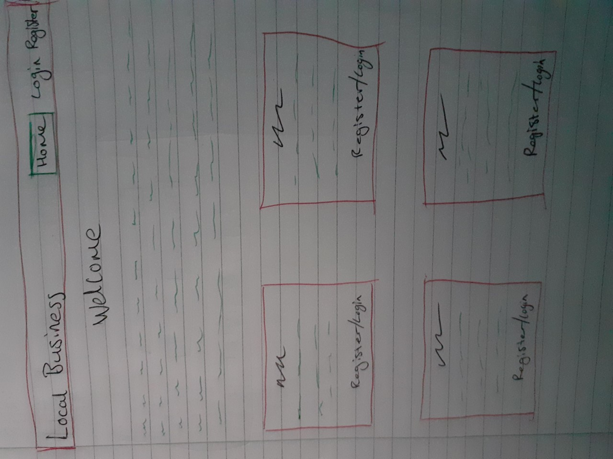
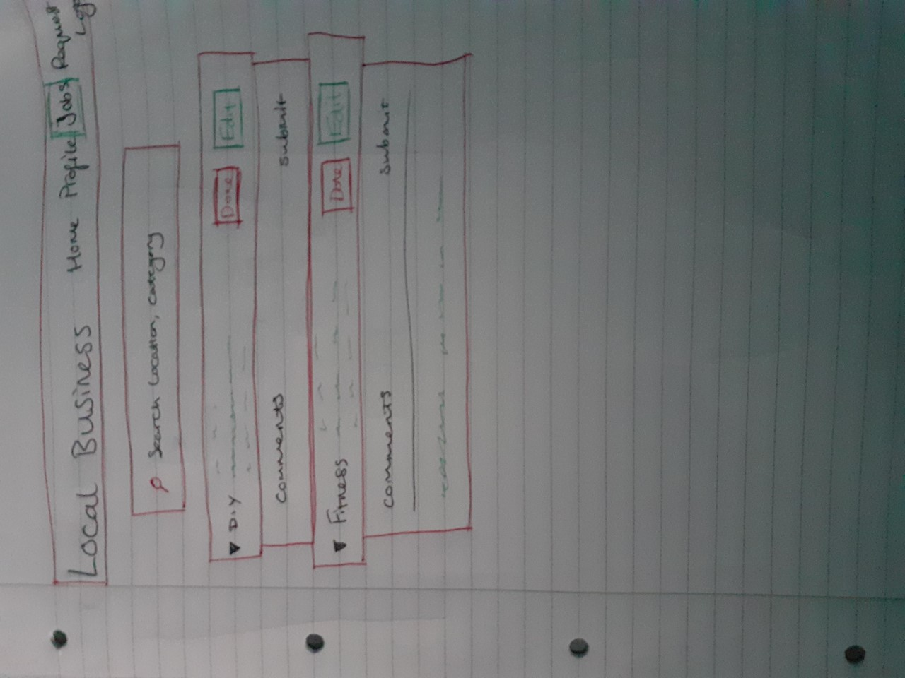
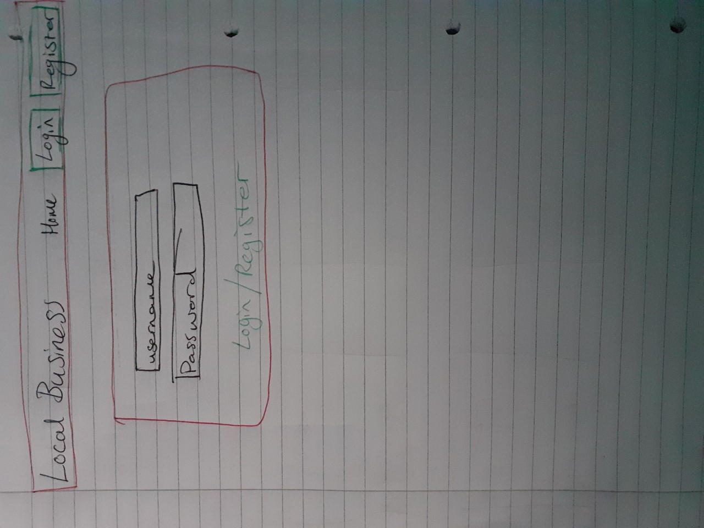
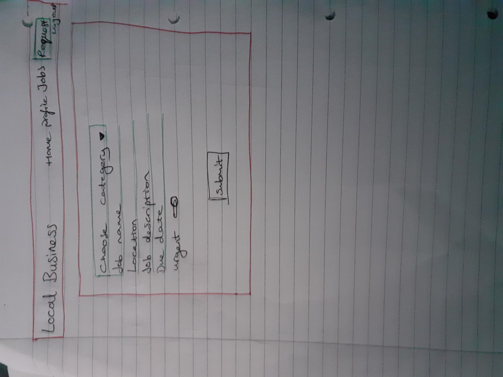
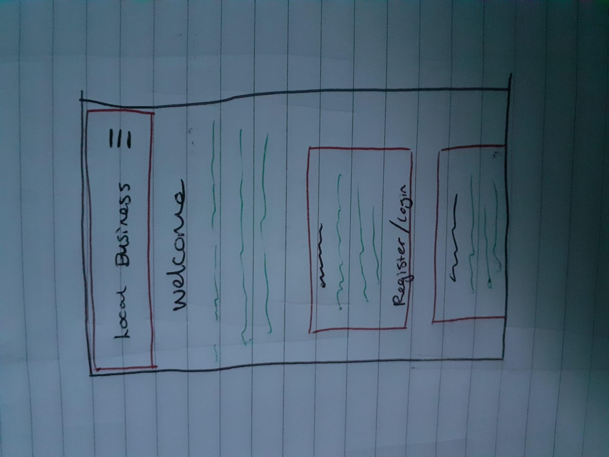
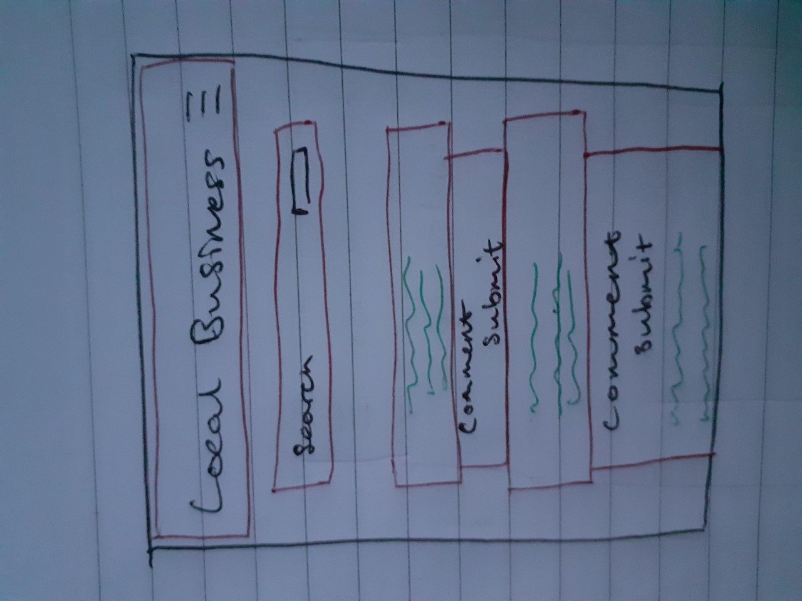
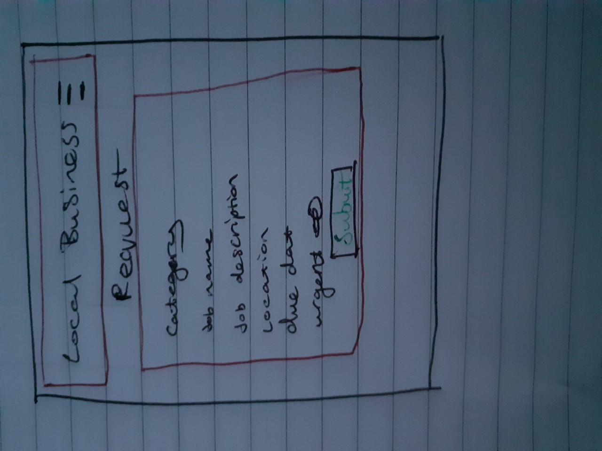

<h1 align="center">Local Business Project 3 Website</h1>

This is a page that allows user to sign up to, login and request jobs. It is made for people to ask around for jobs that can be done by local businesses. They will be able to edit and say complete to jobs they have requested and they can search for jobs if they are a local business looking for work. 

## User Experience (UX)

-   ### User stories

    -   #### First Time Visitor Goals

        1. As a First Time Visitor, I want to easily understand the main purpose of the site and be able to get involved as quick and easy as possible.
        2. As a First Time Visitor, I want to be able to natigate as easily as I can throughout the site as well as finding content.
        3. As a First Time Visitor, I want to look to see if other people have needed the same thing as I have. I also want to see recommendations as this will build trust in the business recommended.

    -   #### Returning Visitor Goals

        1. As a Returning Visitor, I want to be able to edit my request at will in case anything changes.
        2. As a Returning Visitor, I want to see if anyone has been recommended or to check if anyone else has looked for the same thing I have.
        3. As a Returning Visitor, I will have different requests for different categories.

    -   #### Frequent User Goals
        1. As a Frequent User, I want to check to see if there are any newly added requests that match my local business.
        2. As a Frequent User, I want to help out others and leave a comment to help them find what they are looking for.
        3. As a Frequent User, I want easily find my location and jobs that are being requested around there.

-   ### Design
    -   #### Colour Scheme
        -   The two main colours used are orange and grey.
    -   #### Layout
        -  The layout is mainly supposed to be simple and easy to navigate around.

*   ### Wireframes

    -   Home Page Wireframe - 
    -   Jobs Page Wireframe - 
    -   Login and Register Page Wireframe - 
    -   Request Job Page Wireframe - 

    -   Mobile Home Wireframe - 
    -   Mobile Jobs Wireframe - 
    -   Mobile Request Wireframe - 

## Features

-   Responsive on all device sizes

-   Interactive elements

## Technologies Used

### Languages Used

-   [HTML5](https://en.wikipedia.org/wiki/HTML5)
-   [CSS3](https://en.wikipedia.org/wiki/Cascading_Style_Sheets)
-   [JavaScript](https://en.wikipedia.org/wiki/JavaScript)
-   [Python](https://en.wikipedia.org/wiki/Python_(programming_language))

### Frameworks, Libraries & Programs Used

1. [Materialize 1.0.0:](https://getbootstrap.com/docs/4.4/getting-started/introduction/)
    - Materialize was used to assist with the responsiveness and styling of the website.
1. [MongoDB:](https://ianlunn.github.io/Hover/)
    - MongoDB was used as the database for the Interactive code work.
1. [Font Awesome:](https://fontawesome.com/)
    - Font Awesome was used on all pages throughout the website to add icons for aesthetic and UX purposes.
1. [jQuery:](https://jquery.com/)
    - jQuery was used alongside Materialize for things like the side nav bar and request jobs form in JavaScript.
1. [Git](https://git-scm.com/)
    - Git was used for version control by utilizing the Gitpod terminal to commit to Git and Push to GitHub.
1. [GitHub:](https://github.com/)
    - GitHub is used to store the projects code after being pushed from Git.

## Testing

-   [W3C CSS Validator](https://jigsaw.w3.org/css-validator/#validate_by_input) - [Results](https://jigsaw.w3.org/css-validator/validator)
-   [PEP8onlinecheck](http://pep8online.com/) - [Results](http://pep8online.com/checkresult)

### Testing User Stories from User Experience (UX) Section

-   #### First Time Visitor Goals

    1. As a First Time Visitor, I want to easily understand the main purpose of the site and be able to get involved as quick and easy as possible.

        1. The site opens up directly with a welcome page which has enough information for you to understand exactly what the page is about.
        2. You can jump easily into registering from either the navbar or from one of the category explanation boxes.
        3. Even if you are already logged in you can simply click under the category explanations to go straight to a request.

    2. As a First Time Visitor, I want to be able to natigate as easily as I can throughout the site as well as finding content.

        1. The navbar has everything needed to navigate through the website.
        2. Thanks to the search feature, it's easy to find specific jobs, locations and categories.

    3. As a First Time Visitor, I want to look to see if other people have needed the same thing as I have. I also want to see recommendations as this will build trust in the business recommended.
        1. It's easy to use the search feature and using key words and locations can really help.
        2. Comments are useful for finding out if a business is good and trustworthy.

-   #### Returning Visitor Goals

    1. As a Returning Visitor, I want to be able to edit my request at will in case anything changes.

        1. It's easy to navigate to find my job that I requested.
        2. The edit button for changing my request is easy to find.
        3. Once the edit button is clicked on it has already filled the form with the same information making it easier to just change one or two things.

    2. As a Returning Visitor, I want to see if anyone has been recommended or to check if anyone else has looked for the same thing I have.

        1. Using the search bar can help me find my specific job that I requested.
        2. The comment section is easy to get to and is great for getting recommendations.

    3. As a Returning Visitor, I will have different requests for different categories.

        1. Requesting more than 1 job is nice as I can request multiple jobs for different aspects in my life.

-   #### Frequent User Goals

    1. As a Frequent User, I want to check to see if there are any newly added requests that match my local business.

        1. The user would already be comfortable with the website layout and can easily check for new requests and comments.

    2. As a Frequent User, I want to help out others and leave a comment to help them find what they are looking for.

        1. The user would already be comfortable with the website layout and can easily find their location and comment on any request they want.

    3. As a Frequent User, I want easily find my location and jobs that are being requested around there.

        1. The user would already be comfortable using the search feature for finding jobs and locations.

### Further Testing

-   The Website was tested on Google Chrome, Internet Explorer, Microsoft Edge and Safari browsers.
-   The website was viewed on a variety of devices such as Desktop, Laptop and a variety of mobile devices.
-   A large amount of testing was done to ensure that all pages were linking correctly.
-   Friends and family members were asked to review the site and documentation to point out any bugs and/or user experience issues.

### Known Bugs

-   On some mobile devices smaller than 370px the logo begins to be too big for the navbar.

## Deployment

### GitHub Pages

The project was deployed to GitHub Pages using the following steps...

1. Log in to GitHub and locate the [GitHub Repository](https://github.com/JoeLouisDsantos/local-business-project-3)
2. At the top of the Repository (not top of page), locate the "Settings" Button on the menu.
    - Alternatively Click [Here](https://raw.githubusercontent.com/) for a GIF demonstrating the process starting from Step 2.
3. Scroll down the Settings page until you locate the "GitHub Pages" Section.
4. Under "Source", click the dropdown called "None" and select "Master Branch".
5. The page will automatically refresh.
6. Scroll back down through the page to locate the now published site [link](https://joelouisdsantos.github.io/local-business-project-3/) in the "GitHub Pages" section.

### Forking the GitHub Repository

By forking the GitHub Repository we make a copy of the original repository on our GitHub account to view and/or make changes without affecting the original repository by using the following steps...

1. Log in to GitHub and locate the [GitHub Repository](https://github.com/JoeLouisDsantos/local-business-project-3)
2. At the top of the Repository (not top of page) just above the "Settings" Button on the menu, locate the "Fork" Button.
3. You should now have a copy of the original repository in your GitHub account.

### Making a Local Clone

1. Log in to GitHub and locate the [GitHub Repository](https://github.com/JoeLouisDsantos/local-business-project-3)
2. Under the repository name, click "Clone or download".
3. To clone the repository using HTTPS, under "Clone with HTTPS", copy the link.
4. Open Git Bash
5. Change the current working directory to the location where you want the cloned directory to be made.
6. Type `git clone`, and then paste the URL you copied in Step 3.

```
$ git clone https://github.com/JoeLouisDsantos/local-business-project-3.git
```

7. Press Enter. Your local clone will be created.

Click [Here](https://help.github.com/en/github/creating-cloning-and-archiving-repositories/cloning-a-repository#cloning-a-repository-to-github-desktop) to retrieve pictures for some of the buttons and more detailed explanations of the above process.

### Heroku

1. Create a requirements.txt file using the terminal command pip freeze > requirements.txt.
2. Create a Procfile using the terminal command echo web: python app.py > Procfile.
3. git add, git commit and git push these to the Github pages.
4. Create a new app on Heroku by clicking the New button on the dashboard. Give it a name and select the region.
5. On the new app click Deploy > Deployment method and then select github pages.
6. Confirm the linking of the Heroku app and the Github repository.
7. In the Heroku app click settings, then go to reveal config values.
8. Set the following config values:
("IP", "0.0.0.0")
("PORT", "5000")
("SECRET_KEY", "your_secret_key_here")
("MONGO_URI", "mongodb+srv://<USERNAME>:<PASSWORD>@<CLUSTER>-4g3i1.mongodb.net/<DATABASE>?retryWrites=true&w=majority")
("MONGO_DBNAME", "")
9. Go onto deploy, scroll down to manual deployment then click deploy branch.
10. Now the app has been successfully deployed.

## Credits

### Code

-   The format for my project is based on the format from the mini project in Data Centric Development. However similar I have written all of my code myself and added a few extra bits.

-   [Materialize](https://materializecss.com/getting-started.html): Bootstrap Library used throughout the project mainly to make site responsive using the Bootstrap Grid System.

### Content

-   All content was written by the developer.

### Acknowledgements

-   My Mentor for continuous helpful feedback.

-   Tutor support at Code Institute for their support.